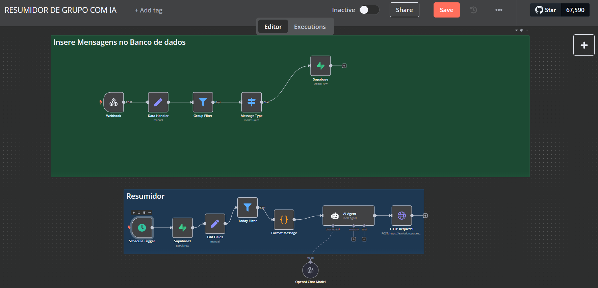

# Resumidor de Conversas Diárias no Grupo

Este fluxo, desenvolvido em **n8n**, atua como um resumidor inteligente das conversas diárias de um grupo do WhatsApp. Ele coleta todas as mensagens enviadas ao longo do dia, filtra os tópicos mais relevantes e, ao final do dia, envia um resumo consolidado – tudo de forma automática e sem intervenção humana.

---

## Objetivo do Fluxo

- **Resumo Diário:** Coletar e organizar as mensagens do grupo, destacando os tópicos e participantes mais importantes.
- **Automação Completa:** Gerar e enviar o resumo ao final do dia, facilitando a consulta das informações sem a necessidade de acessar o grupo constantemente.
- **Personalização:** Utilizar regras definidas e um agente de IA para criar um resumo claro, motivador e informativo.

---

## Como Funciona

### 1. Recepção e Filtragem das Mensagens
- **Webhook de Entrada:** O fluxo é iniciado por um webhook que capta todas as mensagens enviadas no grupo ao longo do dia.
- **Identificação do Tipo de Mensagem:**  
  O nó **Message Type** filtra as mensagens para selecionar apenas aquelas do tipo `conversation` (texto), descartando conteúdos irrelevantes para o resumo.

### 2. Processamento e Organização dos Dados
- **Extração de Informações:**  
  O nó **Data Handler** extrai informações cruciais, como o conteúdo da mensagem, o identificador do participante (telefone) e o nome (pushName).  
- **Configuração de Contexto:**  
  Dados como a data atual, a hora e identificadores de instância são incluídos para criar um registro completo das interações.

### 3. Agendamento para Geração do Resumo
- **Agendamento Noturno:**  
  Um **Schedule Trigger** é configurado para disparar o fluxo às 19h. Essa etapa garante que o resumo seja gerado no final do dia, quando todas as conversas já ocorreram.
- **Ajuste de Data:**  
  O fluxo conta com lógica para ajustar a data caso o dia atual seja final de semana, garantindo que o resumo sempre se refira a um período útil.

### 4. Geração do Resumo
- **Título e Início Visual:**  
  Um nó de **Sticky Note** exibe um título visual (“# Resumidor”) para identificar a ação do fluxo.
- **Agente de IA para Resumo:**  
  Um agente de IA (via **AI Agent**) processa os dados coletados e, com base em um prompt detalhado, gera um resumo organizado e motivador. O prompt orienta a IA a incluir:
  - Um título personalizado com a data.
  - Uma lista dos top 3 participantes do dia.
  - Os tópicos principais, com detalhes como horário e participantes.
  - Um resumo geral dos acontecimentos.
  - Seção para links compartilhados (caso existam).
- **Formatação dos Dados:**  
  Nós de código (como **Format Message**) iteram e formatam as mensagens, convertendo horários e nomes para uma apresentação uniforme e ordenada.

### 5. Armazenamento e Envio
- **Integração com Banco de Dados:**  
  O fluxo pode armazenar o resumo no Supabase para histórico e consultas futuras.
- **Envio Automático:**  
  Finalmente, o resumo é enviado via WhatsApp utilizando a integração com o Evolution/BotConversa, permitindo que os membros do grupo recebam o resumo de forma automática e instantânea.

---

## Destaques Técnicos

- **Automação Total:**  
  O fluxo é acionado automaticamente por webhooks e agendado para execução diária, eliminando a necessidade de intervenção manual.
- **Filtragem Inteligente:**  
  Utiliza nós de switch e filter para garantir que somente as mensagens relevantes sejam processadas.
- **Formatação Precisa:**  
  Funções de código ajustam a formatação dos valores, como a conversão de horários e a separação de nomes, garantindo uma apresentação clara.
- **Integração com IA:**  
  Um agente de IA gera o resumo final com base em regras e prompts customizados, garantindo que o resultado seja organizado, motivador e informativo.
- **Envio Automatizado:**  
  O resumo é enviado automaticamente via WhatsApp, facilitando o acesso às informações sem a necessidade de acesso constante ao grupo.

---

## Benefícios

- **Acesso Rápido à Informação:**  
  Os usuários recebem um resumo consolidado das principais conversas do dia, eliminando a necessidade de buscar manualmente as informações.
- **Economia de Tempo:**  
  Automatiza a compilação e o envio de resumos, liberando a equipe para outras tarefas importantes.
- **Redução de Sobrecarga:**  
  Ao automatizar o resumo, diminui-se a sobrecarga de informações no grupo e melhora-se o foco nos tópicos realmente importantes.
- **Flexibilidade e Personalização:**  
  O fluxo pode ser ajustado para diferentes tipos de grupos e contextos, permitindo customizações conforme as necessidades dos usuários.
- **Integração Completa:**  
  Conecta de forma eficiente webhooks, APIs, agentes de IA e integrações com bancos de dados, garantindo um fluxo robusto e escalável.

---

Este projeto ilustra como a combinação de **n8n**, **APIs de comunicação** e **agentes de IA** pode transformar dados brutos de conversas em resumos valiosos e organizados, melhorando a comunicação e a gestão de informações em grupos de WhatsApp.
